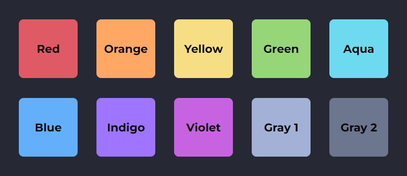
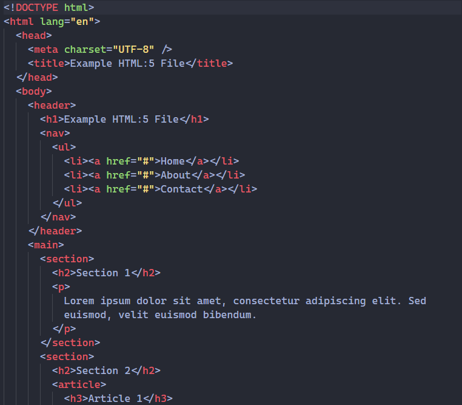
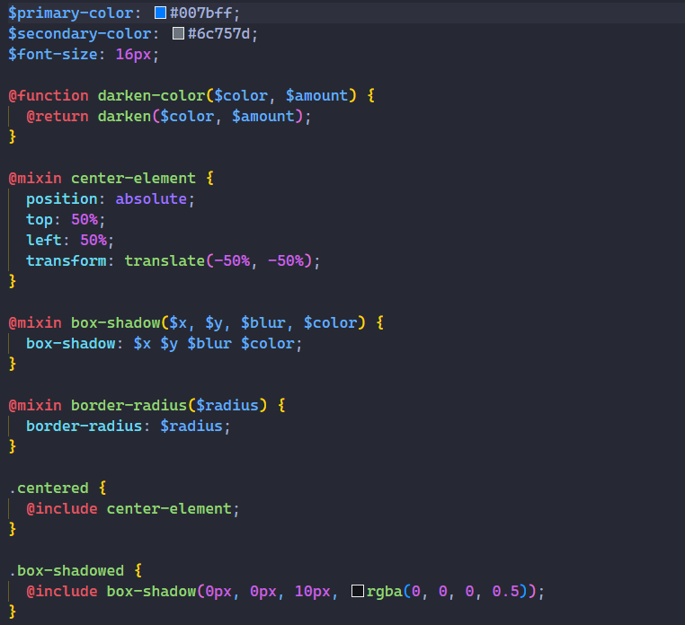
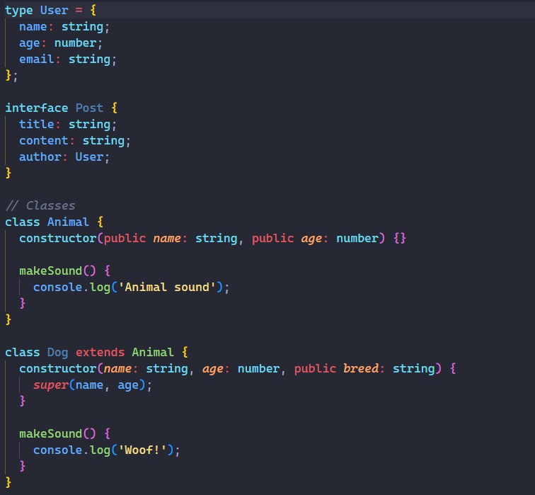
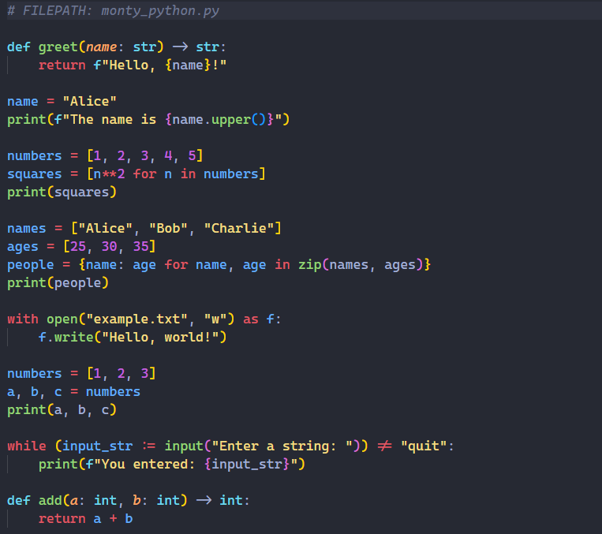
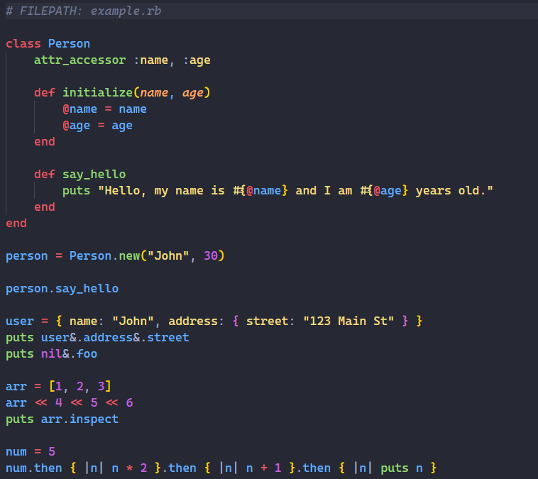

# Stellar Night Dark Theme

## Description

Stellar Night is a flat, mildly blue-shifted, dark gray theme with colorful code that aims to largely avoid whites in favor of RGB colors. There are exceptions to that rule and some default grays, but the overal goal is to make the theme bright and colorful.

This theme is visually inspired by one of my favorite themes, [One Monokai](https://marketplace.visualstudio.com/items?itemName=azemoh.one-monokai), but is built with custom colors for both the UI and the code.

## Screenshots

#### The general color scheme:

#### How the color scheme looks in a variety of languages:

  
HTML

  

  
SCSS

  

  
TypeScript

  

  
Python

  

  
Ruby

  

## Improvements

This is very much a work in progress, so please don't hesitate to [open an issue](https://github.com/fcangelo/vscode-stellar-night/issues) if something looks a bit off.
